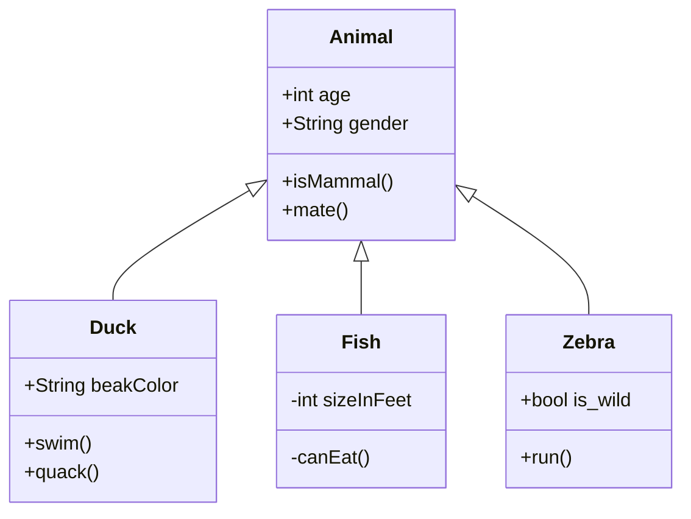
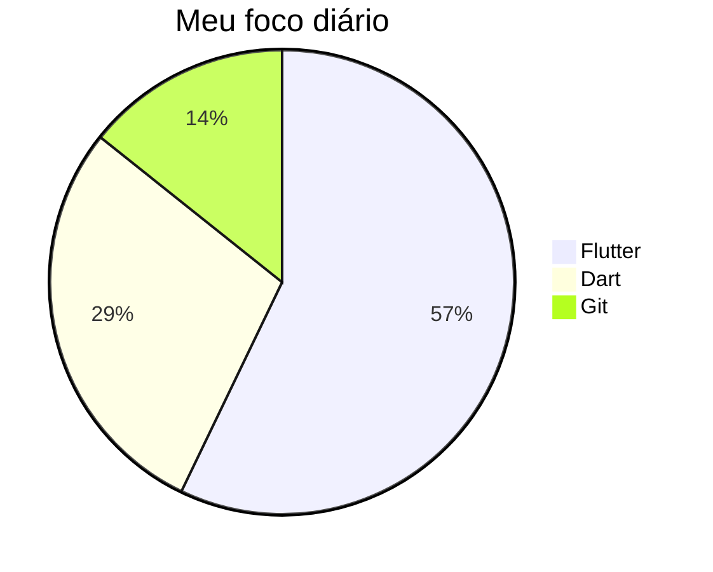

# Estudando Git

Repositório para meus estudos pessoais sobre Git

## Markdown

Treinando **Markdown** a partir do vídeo _Markdown Crash Course_ do canal [Traversy Media](https://www.youtube.com/watch?v=HUBNt18RFbo) e documentação [GitHub Docs](https://docs.github.com/pt/get-started/writing-on-github/getting-started-with-writing-and-formatting-on-github/basic-writing-and-formatting-syntax)

> Um blockquote

Código em Dart Language

```dart
  void main() {
  for (int i = 0; i < 5; i++) {
    print('hello ${i + 1}');
  }
}
```

Listar os dispositivos disponíveis

```flutter
  flutter devices
```

Inicializar a aplicação utilizando o Google Chrome

```flutter
  flutter run -d chrome --no-sound-null-safety
```

Comandos Git

```
  git init
  git status
  git add .
  git commit -m "Initial Commit"
```

---

## Tipos de lista

Lista não ordenada, ordenada e checkbox

- Item 1
- Item 2
  - Subitem 1
  - Subitem 2
  - Subitem 3
- Item 3

1. Item 1
1. Item 2
1. Item 3

- [x] Task 1
- [ ] Task 2
- [ ] Task 3

---

## Trabalhando com tabelas

| Primeiro cabeçalho | Segundo cabeçalho  |
| ------------------ | ------------------ |
| Célula de conteúdo | Célula de conteúdo |
| Célula de conteúdo | Célula de conteúdo |

| Comando    | Descrição                                                |
| ---------- | -------------------------------------------------------- |
| git status | Lista de todos os arquivos modificados ou novos          |
| git diff   | Mostra as diferenças do arquivo que não foram preparadas |

| Comando      | Descrição                                                    |
| ------------ | ------------------------------------------------------------ |
| `git status` | Lista de todos os arquivos _modificados ou novos_            |
| `git diff`   | Mostra as diferenças do arquivo que **não foram** preparadas |

---

#Diagramas do [mermaid](https://mermaid-js.github.io/mermaid/#/)




